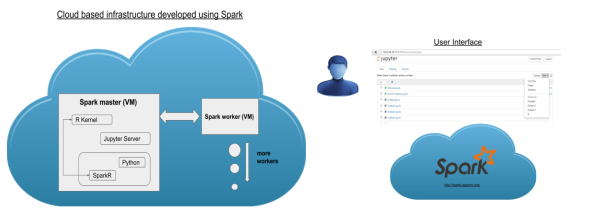
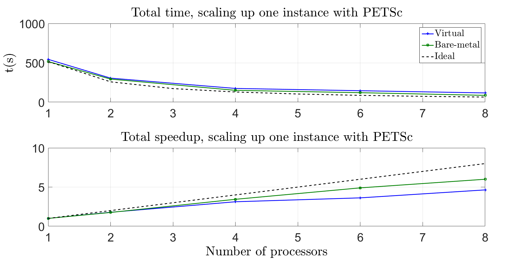

# Towards Moving Scientific Applications in the Cloud
A framework designed by the resources from Swedish National Infrastructure for computing (SNIC) using Apache Spark, SparkR, R language & Jupyter Notebook to enable computations of highly parallel scientific applications.

- Cloud computing provides usability, scalability and on demand availability of computational and storage resources, remotely. These are the characteristics required by scientific applications and that’s why we used it. The project had two dimensions. First one addresses the benefits of cloud infrastructure for end users. In the second portion, we tried to do performance analysis.

## Overview

### Project Goals
- Make this architecture viable for other scientific applications as well.
- Make it ready & useable from scratch on any Cloud i.e. Amazon, HP Helion etc. with minimal effort.
- Study the performance of a computationally intensive scientific application when executed in a cloud environment.

### Directions
- Application as a service
- Performance analysis of scientific applications

### QTL as a service (QTLaaS)
Using already existing technologies i.e. R language, Apache Spark, SparkR, Jupyter notebook and OpenStack cloud infrastructure, 
we have designed a framework that help biologists run their QTL (Quantitative traits loci) code on cloud.

### Problem
Cloud computing provides usability, scalability and on demand availability of resources, remotely. That’s why we are using it for scientific applications. 
We have designed an architecture in cloud that help scientists run their applications elastically. In addition we are also 
quantifying the performance overhead when using cloud to solve a numerical experiment. 
To evaluate performance, we ran already existing MPI (Message Passing Interface) code on the cloud.

### Features
1. System Scalability
2. Interactivity
3. Automation
4. Portability
5. User familiar environment settings

### Performance Analysis
When performing numerical experiments using cloud, there are two potential causes for performance degradation. The causes are consolidation and virtualization. 
- Consolidation occurs when more and more applications run on a single physical server.
- Virtualization is the layer between an application tier and the physical hardware in addition to the operating system.

### Method
When trying to evaluate the performance using the cloud, Laplace’s equation was solved, discretized using finite 
elements and solved by the Algebraic Multigrid method (AMG) and simulated using the open source scientific libraries deal.ii and PETSc. 
 - Deal.ii handles the mesh generation and the discretization. 
 - The arising large linear system of equations is solved by the AMG implementation, provided by PETSc. 
 - The code is parallelized using MPI.

### Results
From the results we see that, the run time while solving the problem on the cloud scales as well as when solving it on the bare metal machine. 
The increase usability and simplicity that comes with our framework can be seen as a tradeoff with performance degradation that appears when using the cloud.

### Running Server:
In case you are using Swedish National Infrastructure for computing (SNIC), based on OpenStack cloud suite, download (.sh) configuration file and source it inside your Ubuntu or Mac terminal. For example, in my case it is "ACC-Course-openrc.sh". 

Also install python novaclient on your machine by using the following command:

> sudo apt-get install python-novaclient

    -  Now check the availability of nova by typing "nova" in your terminal. It'll display list of commands. Go through them if needed.
    -  Type the following command in your terminal for setting up Spark Master.

> nova boot -flavor m1.medium --image "Ubuntu Server 14.04 LTS (Trusty Tahr)" --key-name Saim --user-data=init-sparkMaster.sh SparkMaster

You should put your 'key name' after the argument --key-name. Similarly, you can choose -flavor either large, medium or small according to your requirement. And as well as --image.

For --user-data argument, you have to use the files (i.e. initSparkMaster and initSparkWorker etc) and made specified changes in them. Download them at the current directory from where you'll run your terminal command. You can check it by typing 'pwd' inside your terminal. 

    -  Have a look at the attachment file: 'init-sparkMaster.sh'. Do change the IP of network topology.
    -  Similarly, also look at the code inside the file: 'init-sparkWorker.sh'. And make necessary changes mentioned inside it.
    -  Now type the following command inside the terminal of your worker VM:

> nova boot -flavor m1.medium --image "Ubuntu Server 14.04 LTS (Trusty Tahr)" --key-name Saim --user-data=init-sparkWorker.sh SparkWorker

Give time, after running each of the mentioned commands to let spark master and worker code run, and it will automatically install all the required libraries.

P.S. You must run two seperate Virtual Machines as Spark Worker and Spark Master.  
